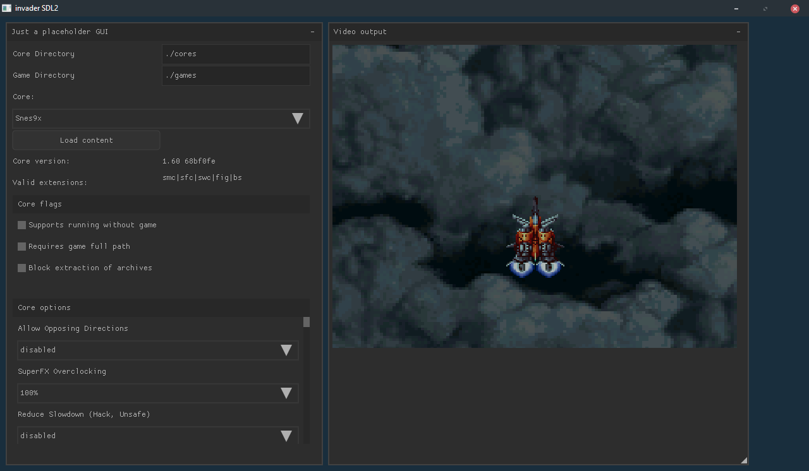

# invader

invader is an experimental implementation of the libretro API.

It's split in two parts:
- piccolo as the libretro player implementation
- kami as the GUI frontend, currently it uses nuklear, and uses SDL2 as it's backend

As for the goals, nothing concrete so far, we'll see how it goes.

# Compilation

```
git clone git@git.retromods.org:dev/invader.git
cd invader
git submodule update --init
make
```
# Current Progress
## Backend
- [X] core loading
- [X] core initialization
- [ ] content loading
- [X] video rendering
- [ ] audio rendering
- [ ] input processing

## Frontend
- [ ] everything

## Screenshots

### 0.1.0


### 0.1.1


### 0.1.2

