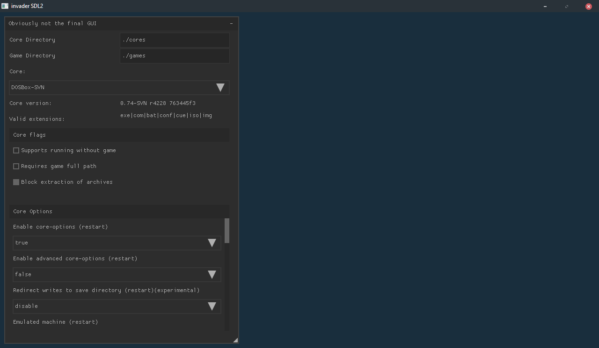

# invader

invader is an experimental implementation of the libretro API.

It's split in two parts:
- piccolo as the libretro player implementation
- kami as the GUI frontend, currently it uses imgui for the user interface and SDL2/OpenGL3 for rendering

# Compilation

```
git clone git@git.retromods.org:dev/invader.git
cd invader
git submodule update --init
make -C src/
```

# Current Progress
## Backend
- [X] core loading
- [X] core initialization
- [X] content loading
- [X] video rendering
- [ ] audio rendering
- [X] input processing
- [X] core options v1

## Frontend
- [ ] everything

## Screenshots

### 0.1.3


### 0.1.2


### 0.1.1


### 0.1.0
